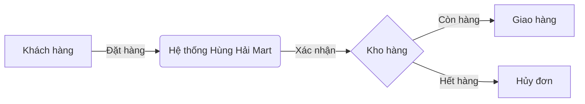

# Graphyfy Skill

Khi người dùng yêu cầu bạn vẽ sơ đồ, "graphyfy" một quy trình, hoặc cần minh họa kiến trúc hệ thống, hãy tuân thủ các bước sau:

1. **Phân tích yêu cầu:** Đọc kỹ hệ thống, quy trình hoặc lược đồ cơ sở dữ liệu mà người dùng muốn vẽ.
2. **Sử dụng cú pháp Mermaid.js:** 
   - `flowchart TD` (Từ trên xuống) hoặc `flowchart LR` (Từ trái sang phải) cho các quy trình/luồng chạy.
   - `sequenceDiagram` cho biểu đồ tuần tự (như luồng gọi API, tương tác giữa Client và Server).
   - `erDiagram` cho lược đồ quan hệ Cơ sở dữ liệu (Database Schema).
   - `classDiagram` cho biểu đồ lớp OOP.
3. **Quy tắc định dạng:** 
   - Bao bọc sơ đồ trong khối mã (code block) với ngôn ngữ là `mermaid`.
   - Tránh sử dụng các ký tự đặc biệt có thể làm vỡ cú pháp của Mermaid (như ngoặc nhọn, HTML tags không thoát).
   - Ghi chú và tên các node nên viết bằng tiếng Việt ngắn gọn, dễ hiểu.
4. **Giải thích ngắn gọn:** Sau khi vẽ xong, hãy cung cấp 2-3 câu giải thích tóm tắt về sơ đồ bên dưới.

**Ví dụ:**

